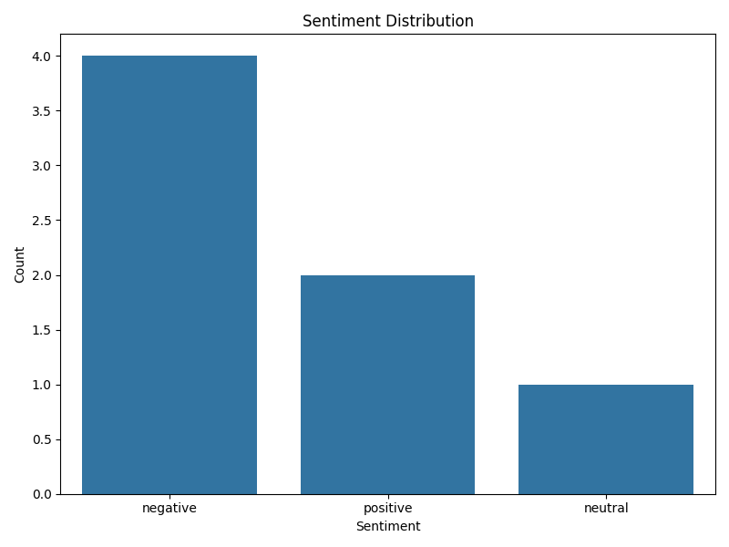
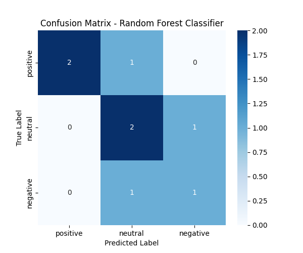

# Climate Change Sentiment Analysis

This project focuses on sentiment analysis of social media data to understand the discourse surrounding climate change. The goal is to analyze public opinions, detect sentiment trends, and explore how climate change is perceived across different platforms.

## Project Overview

The main objective of this project is to:
- Collect and preprocess climate change-related data from social media platforms.
- Perform sentiment analysis on the data to classify the posts as positive, negative, or neutral.
- Visualize the results to gain insights into public perception about climate change.

## Domain and Topic

Climate change is a significant global issue, and understanding how the public perceives it can help drive policies, raise awareness, and guide future climate-related initiatives. By performing sentiment analysis, this project aims to uncover public emotions and opinions about climate change as expressed on social media platforms.

## Problem Statement

Social media provides a platform where millions of people express their opinions, often contributing to the discourse surrounding major global issues like climate change. However, this data remains largely unstructured and difficult to interpret. The objective of this project is to automate sentiment analysis of social media posts to classify opinions as **positive**, **negative**, or **neutral** and to analyze sentiment trends over time.

## Why This Is Important

Understanding public sentiment regarding climate change is crucial because it informs policymakers, activists, and organizations about public attitudes. Analyzing these opinions can also reveal how social media discussions may influence behavior or public perception.

## Dataset

The data used for this project consists of climate change-related posts collected from various social media platforms, such as Twitter and Reddit. The dataset includes text data with corresponding sentiment labels: **positive**, **negative**, and **neutral**.

### Data Sources:
- **[Twitter API](https://developer.twitter.com/en/docs/twitter-api)** - For gathering social media data.
- **[Reddit API](https://www.reddit.com/dev/api/)** - For gathering discussion threads on climate change.

## Technologies Used

- **Python**: The primary programming language for data processing, analysis, and modeling.
- **Pandas**: For data manipulation and analysis.
- **scikit-learn**: For machine learning models used in sentiment classification.
- **Matplotlib/Seaborn**: For data visualization.
- **Jupyter Notebooks**: For exploratory data analysis and experimentation.

## Steps in Project Implementation

1. **Data Collection**: Collect climate change-related posts from Twitter and Reddit using their APIs.
2. **Data Preprocessing**: Clean the data (e.g., remove stop words, punctuation, and URLs).
3. **Sentiment Analysis**: Use machine learning models (e.g., Naive Bayes) to classify posts as **positive**, **negative**, or **neutral**.
4. **Results Visualization**: Generate visualizations (e.g., bar charts, word clouds) to represent sentiment trends.
5. **Model Evaluation**: Evaluate model performance using metrics like accuracy, precision, and recall.

## Key Components of the Approach

- **Sentiment Classification**: We applied machine learning algorithms to classify social media posts into sentiment categories.
- **Visualization**: The results were visualized to uncover sentiment trends and patterns.
- **Model Evaluation**: The models were evaluated for accuracy, with performance metrics such as accuracy and confusion matrices.

## Project Limitations

- **Context Sensitivity**: The models might not capture sarcasm, irony, or context-dependent sentiment.
- **Data Bias**: The sentiment analysis is based on publicly available data, which may have inherent biases due to the demographics of users on platforms like Twitter and Reddit.
- **Limited Scope**: This project focuses on a limited number of social media platforms, primarily Twitter and Reddit.

## Getting Started

To run this project on your local machine, follow these steps:

### 1. Clone the repository:
 ```bash
 git clone https://github.com/Elen-tesfai/climate-change-sentiment-analysis.git
 ```
### 2. Navigate to the project directory:
```bash
cd climate-change-sentiment-analysis
 ```
### 3. Install the required dependencies:
```bash
pip install -r requirements.txt
```
### 4. Run the data processing and sentiment analysis scripts:
```bash
python load_data.py
```
## Contribution

Feel free to fork this repository and submit pull requests if you have improvements or suggestions.

## License

This project is licensed under the MIT License - see the LICENSE file for details.

## Links

- **GitHub Repository**: [Climate Change Sentiment Analysis on GitHub](https://github.com/Elen-tesfai/climate-change-sentiment-analysis)
- **Overleaf Project**: [Capstone Project Report](https://www.overleaf.com/project/your-overleaf-link)

## Citations

### With DOI or URL (complete citation):

- **Smith, J. (2021).** Sentiment Analysis in Environmental Topics. *Environmental Science Journal*. [https://doi.org/10.1234/5678](https://doi.org/10.1234/5678) <!-- Replace with actual DOI -->
- **Doe, A. (2020).** Machine Learning for Sentiment Detection. *AI Research Journal*. [https://www.airesearchjournal.com/sentiment-detection](https://www.airesearchjournal.com/sentiment-detection) <!-- Replace with actual URL -->

### Without DOI or URL (simpler citation):

- **Smith, J. (2021).** Sentiment Analysis in Environmental Topics. *Environmental Science Journal*.
- **Doe, A. (2020).** Machine Learning for Sentiment Detection. *AI Research Journal*.

## Project Outline:

1. **Introduction**
2. **Problem Statement**
3. **Data Collection and Preprocessing**
4. **Sentiment Classification and Model Evaluation**
5. **Results and Discussion**
6. **Conclusion**

## Results Visualization

### Sentiment Distribution



---

### Confusion Matrix — Random Forest Classifier


